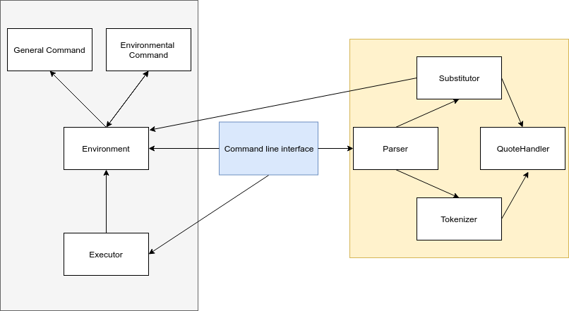

# Архитектура CLI

В программе можно выделить два основных блока:

* Блок парсинга комманд

* Блок основной логики исполнения команд

Environment кранят переменные и команды окружения. Команды нужно регистрировать в окружении. Все команды разделены на те, которые используют и, возможно, изменяют окружение (Environmental Command), и команды, которые не зависят от окружения (General Command). Executor исполняет команды в окружении.

Parser разбивает строки на отдельные команды и их аргументы. Substitutor подставляет значения переменных из окружения, если необходимо. Tokenizer разбивает строки на токены.

